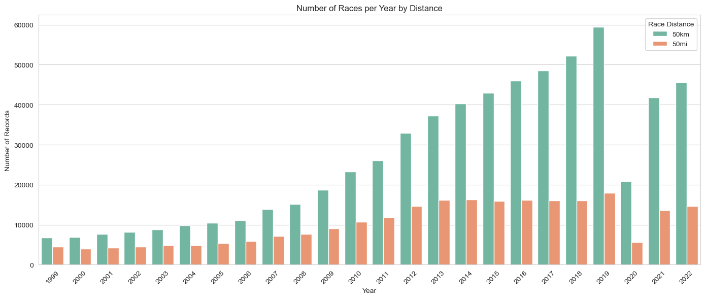
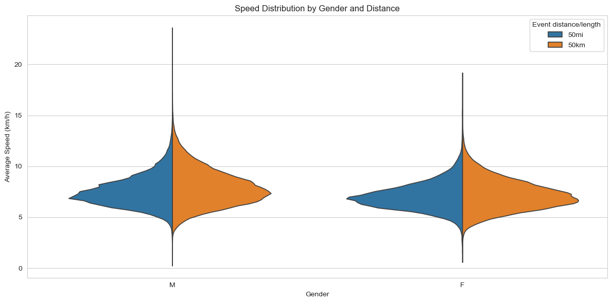
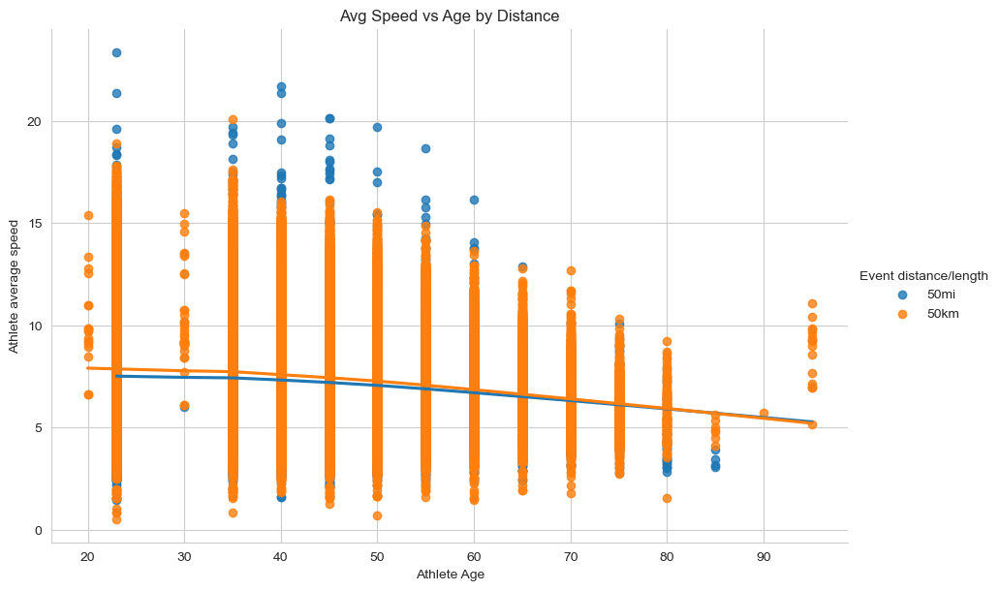
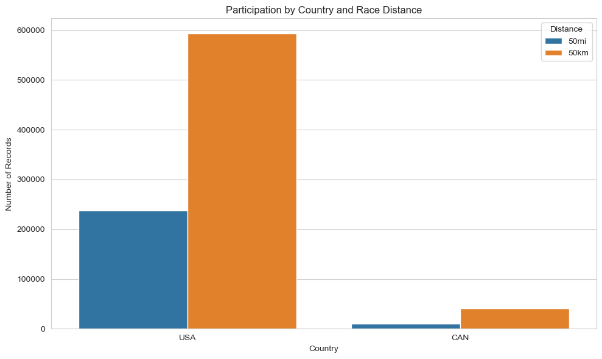
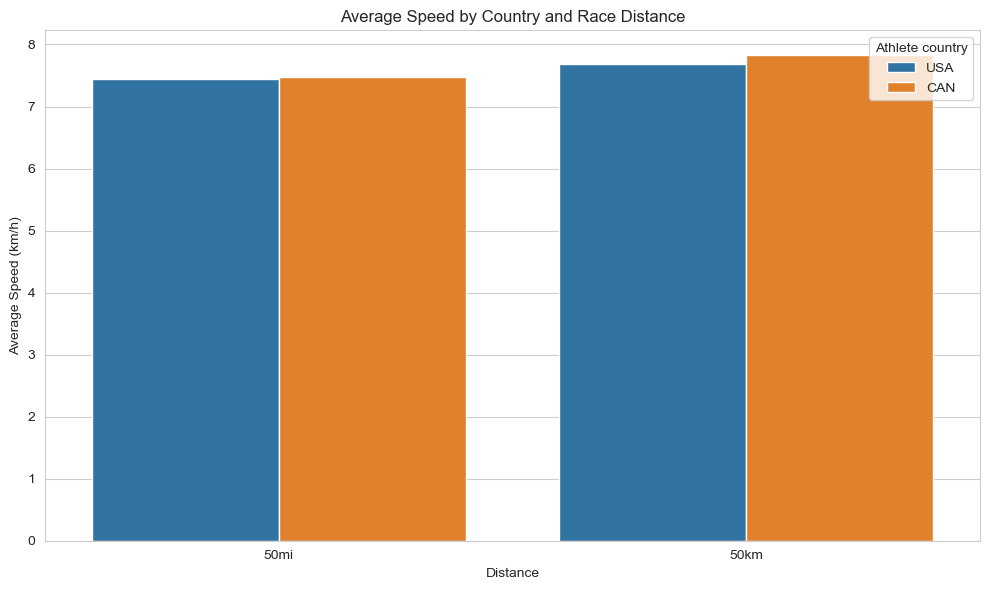

# Ultra-Marathon Performance Analysis (1999–2022)

## Project Overview

This project explores long-term trends in participation and performance in ultra-marathon races across North America. Focusing on the most popular standardized distances — **50km** and **50mi** — the analysis evaluates how **age, gender, and time** influence running performance for **Canadian and U.S. athletes** over the period **1999 to 2022**.

The project showcases the full data analytics lifecycle — from cleaning and transformation, to exploratory data visualization, to statistical modeling — using industry-standard tools in Python.

**Data Set**: [Raw Data](https://www.kaggle.com/datasets/aiaiaidavid/the-big-dataset-of-ultra-marathon-running/data?select=TWO_CENTURIES_OF_UM_RACES.csv)
---

## Tools & Libraries Used

- **Python** (`pandas`, `numpy`)
- **Visualization**: `matplotlib`, `seaborn`
- **Modeling**: `statsmodels`
- **Notebook Environment**: Jupyter

---

## Data Cleaning (`umCleaning.ipynb`)

- Filtered data for:
  - **Countries**: Only `USA` and `CAN`
  - **Distances**: `50km` and `50mi` only
  - **Years**: 1999–2022
- Standardized race distance format
- Parsed `Athlete average speed` and converted race times from string to `timedelta`
- Dropped columns with excessive missing values (e.g., `Athlete club`, `Athlete year of birth`)
- Engineered:
  - `Athlete Age` (from age categories)
  - `Month-Year` from event dates
- Exported cleaned dataset:  
  `ultra_northamerica_classic.csv`

---
## Exploratory Data Analysis (`umEDA.ipynb`)

### Key Visual Analyses
- **Participation Trends**:
  - Count of races per year and by distance, dip in 2020 due to COVID-19
     
- **Speed Distributions**:
  - By gender and distance
    
- **Age and Performance**:
  - Violin and regression plots showed speed decline with age
    
- **Country Comparison**:
  - U.S. has higher participation; average speeds are similar across both nations
      

### EDA Insights:
- **50km races dominate** in participation, particularly post-2010.
- **Average speed has slightly decreased** over the years, possibly due to greater recreational participation.
- **Gender-based performance gaps** are visible, with males running faster on average.
- **Older athletes show gradual speed decline**, more so in 50km than in 50mi.

---

## Statistical Modeling (`umAnalysis.ipynb`)

Used **Ordinary Least Squares (OLS)** regression to quantify how year, age, and gender affect average speed.

### Model Formula:
```python
Athlete average speed ~ Year of event + Athlete Age + Gender_encoded
```

### 50km Model Results
- R² = **0.113**
- Year: **−0.0586 km/h/year**
- Age: **−0.0317 km/h/year**
- Female gender: **−0.7368 km/h**

### 50mi Model Results
- R² = **0.098**
- Year: **−0.0500 km/h/year**
- Age: **−0.0262 km/h/year**
- Female gender: **−0.4962 km/h**

### Insights:
- Both distances show a **decline in average speed over time**, possibly due to broader accessibility and participation.
- **Age negatively impacts speed** in both distances, aligning with physiological expectations.
- **Gender gap is larger in 50km** than in 50mi races, supporting findings that **longer distances reduce the performance difference** between men and women.
- In an interaction model, the **gender gap in 50km races was found to be narrowing over time**, but no such trend was observed in 50mi races.

### Limitations:
**1. Modest explanatory power:**
- R² values (0.10–0.11) suggest that most of the variation in speed is explained by unmeasured factors like **training quality, course difficulty, weather, and strategy**. More typical in human performance analysis.
  
**2. No non-linear effects or interaction terms included here:**
- Age may have a non-linear relationship with performance (e.g., performance plateaus in middle age before decline).
- Gender × Year interaction (tested separately) showed significance for 50km but not 50mi.
  
**3. No course-specific variables:**
- **Elevation, terrain, and weather** could strongly influence speed but are unavailable in the current dataset.

---

## Skills Demonstrated

- Data cleaning and wrangling at scale (>600,000 rows)
- Feature engineering from messy race metadata
- Multi-dimensional visualization and comparative analysis
- Building and interpreting linear regression models with interaction terms
- Communicating findings with clarity and context

---

## Next Steps & Improvements

- Use **mixed-effects models** to account for repeated athletes (`Athlete ID`)
- Analyze **top 10% performers** to focus on elite trends
- Incorporate **terrain or race elevation data** for deeper performance modeling
- Build an interactive **Tableau dashboard** for public exploration

---
